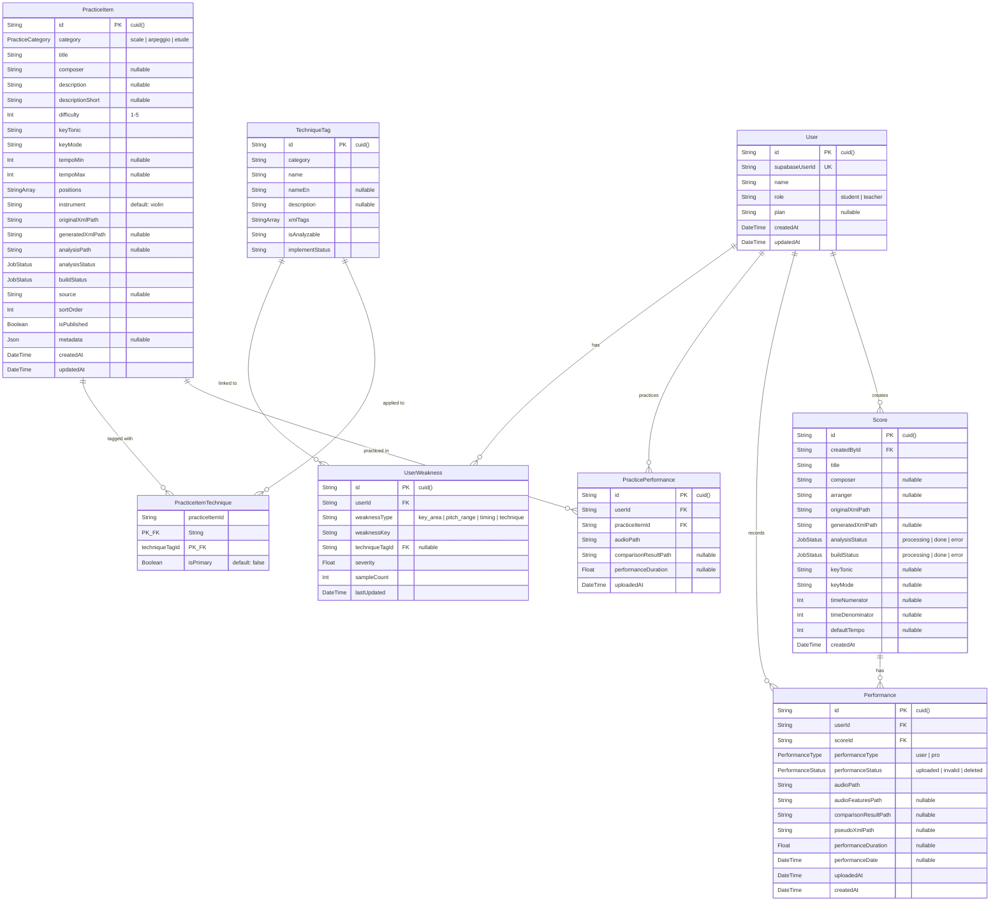
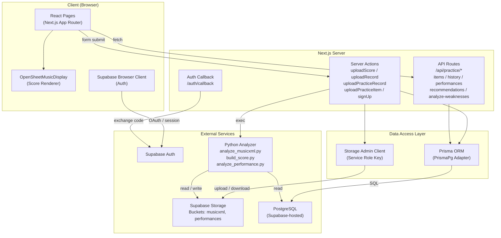
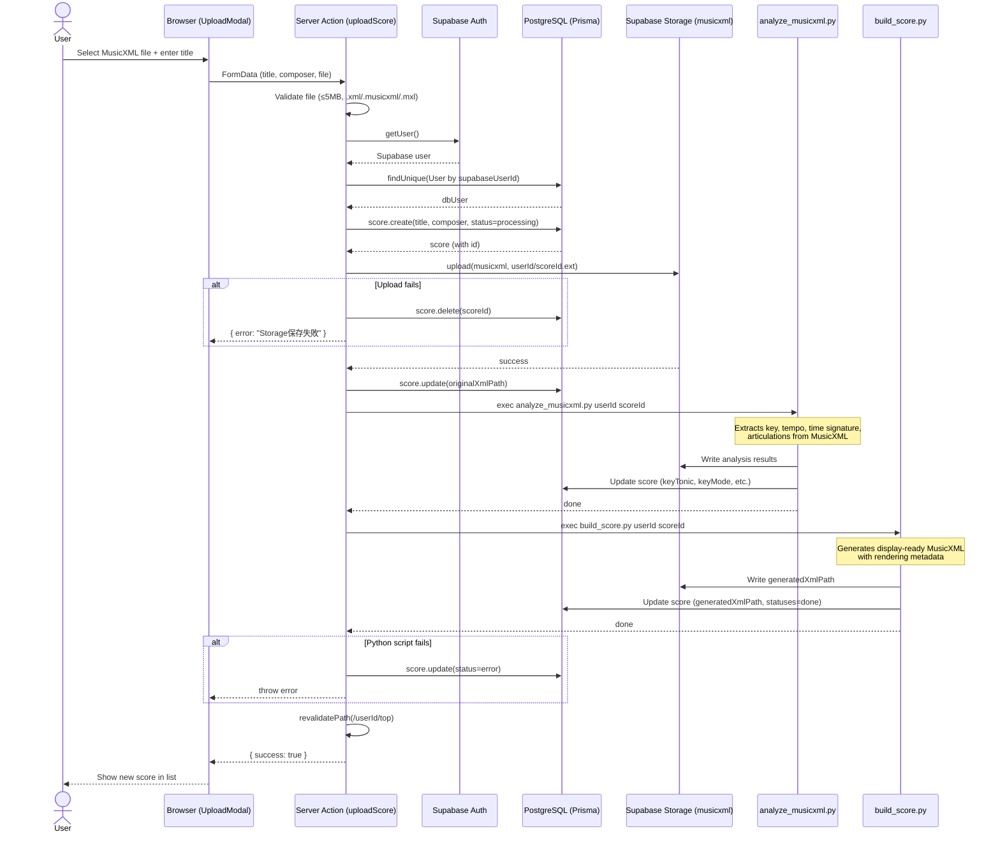
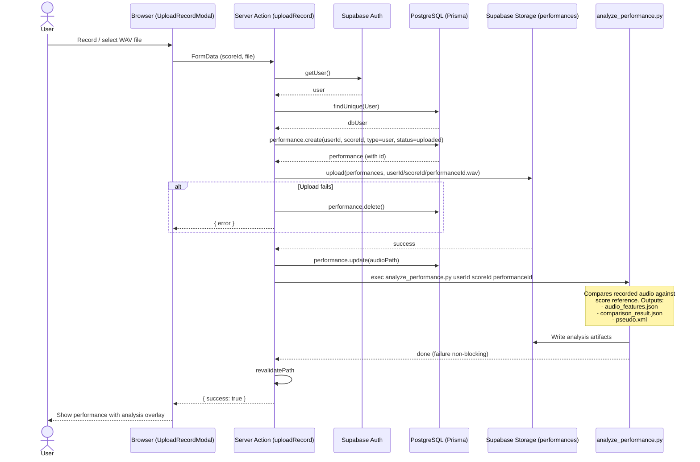

# Music App - Project Architecture Documentation

## Table of Contents

1. [Directory Structure](#1-directory-structure)
2. [ER Diagram](#2-er-diagram)
3. [System Architecture](#3-system-architecture)
4. [Data Flow - Score Upload Sequence](#4-data-flow---score-upload-sequence)
5. [Main Modules and Responsibilities](#5-main-modules-and-responsibilities)
6. [Entity Relationships Explained](#6-entity-relationships-explained)

---

## 1. Directory Structure

```
music-app/
├── app/
│   ├── [userId]/                        # Dynamic user-scoped pages
│   │   ├── admin/
│   │   │   ├── adminPractice.tsx         # Admin form for practice items
│   │   │   └── practice/
│   │   │       └── page.tsx             # Admin practice management page
│   │   ├── components/
│   │   │   ├── Header.tsx               # App header (logo, title)
│   │   │   ├── Sidebar.tsx              # Navigation sidebar
│   │   │   ├── UploadModal.tsx          # MusicXML score upload modal
│   │   │   └── UploadRecordModal.tsx    # Performance recording upload modal
│   │   ├── practice/                    # Practice module pages
│   │   │   ├── [category]/
│   │   │   │   ├── [itemId]/
│   │   │   │   │   └── page.tsx         # Individual practice item detail
│   │   │   │   ├── page.tsx             # Category listing (server)
│   │   │   │   └── practiceLIst.tsx     # Category listing (client, filters)
│   │   │   ├── page.tsx                 # Practice top (server, recommendations)
│   │   │   └── practiceTop.tsx          # Practice top (client)
│   │   ├── profile/
│   │   │   └── page.tsx                 # User profile page
│   │   ├── share/
│   │   │   └── page.tsx                 # Teacher sharing page
│   │   ├── top/                         # Score management pages
│   │   │   ├── [scoreId]/
│   │   │   │   ├── page.tsx             # Score detail (server)
│   │   │   │   └── scoreDetail.tsx      # Score detail (client)
│   │   │   ├── page.tsx                 # Score list (server)
│   │   │   └── TopClient.tsx            # Score list (client)
│   │   └── layout.tsx                   # User area layout (Header + Sidebar)
│   │
│   ├── _libs/                           # Shared library clients
│   │   ├── prisma.ts                    # Prisma client (PostgreSQL + PrismaPg adapter)
│   │   ├── storageAdmin.ts              # Supabase storage (service role)
│   │   ├── supabase.ts                  # Generic Supabase client
│   │   ├── supabaseBrowser.ts           # Browser-side Supabase client
│   │   └── supabaseServer.ts            # Server-side Supabase client
│   │
│   ├── actions/                         # Next.js Server Actions
│   │   ├── signUpAction.ts              # User registration
│   │   ├── uploadScore.ts               # MusicXML score upload + analysis
│   │   ├── uploadRecord.ts              # Performance recording upload + analysis
│   │   ├── uploadPracticeRecord.ts      # Practice recording upload + analysis
│   │   └── uploadPracticeItem.ts        # Admin: create practice item
│   │
│   ├── api/                             # REST API Routes
│   │   └── practice/
│   │       ├── analyze-weaknesses/
│   │       │   └── route.ts             # POST: analyze user weaknesses
│   │       ├── history/
│   │       │   └── route.ts             # GET: practice history
│   │       ├── items/
│   │       │   ├── route.ts             # GET: list/filter practice items
│   │       │   └── [itemId]/
│   │       │       └── route.ts         # GET: single practice item
│   │       ├── performances/
│   │       │   └── route.ts             # POST: create practice performance
│   │       └── recommendations/
│   │           └── route.ts             # GET: personalized recommendations
│   │
│   ├── auth/
│   │   └── callback/
│   │       └── route.ts                 # OAuth callback handler
│   │
│   ├── generated/prisma/               # Prisma generated client
│   ├── types/
│   │   └── score.ts                     # ScoreView interface
│   │
│   ├── login/page.tsx                   # Login page
│   ├── signUp/page.tsx                  # Sign-up page
│   ├── forgotPassword/page.tsx          # Password reset page
│   ├── updatePassword/updatePassword.tsx
│   ├── layout.tsx                       # Root layout
│   └── page.tsx                         # Score comparison visualizer (OSMD)
│
├── prisma/
│   ├── schema.prisma                    # Database schema definition
│   └── migrations/                      # Migration history
│
├── scripts/
│   └── seed-technique-tags.ts           # Seed TechniqueTag data
│
├── public/                              # Static assets
│
├── package.json                         # Dependencies & scripts
├── tsconfig.json                        # TypeScript config
├── next.config.ts                       # Next.js config (50MB body limit)
├── prisma.config.ts                     # Prisma config
└── eslint.config.mjs                    # ESLint config
```

---

## 2. ER Diagram



---

## 3. System Architecture



---

## 4. Data Flow - Score Upload Sequence



### Performance Recording Upload Flow



---

## 5. Main Modules and Responsibilities

### 5.1 Authentication Module

| File | Responsibility |
|---|---|
| `app/_libs/supabaseServer.ts` | Creates server-side Supabase client with cookie-based sessions |
| `app/_libs/supabaseBrowser.ts` | Creates browser-side Supabase client for client components |
| `app/auth/callback/route.ts` | Handles OAuth callback, exchanges auth code for session |
| `app/actions/signUpAction.ts` | Creates Supabase auth user + Prisma `User` record (with rollback) |
| `app/login/page.tsx` | Email/password login + Google OAuth |
| `app/signUp/page.tsx` | Registration form (name, email, password, plan, role) |

### 5.2 Score Module

| File | Responsibility |
|---|---|
| `app/actions/uploadScore.ts` | Uploads MusicXML to storage, creates `Score`, triggers Python analysis |
| `app/[userId]/top/page.tsx` | Server component - fetches all scores for a user |
| `app/[userId]/top/TopClient.tsx` | Client component - renders score cards with edit/delete actions |
| `app/[userId]/top/[scoreId]/scoreDetail.tsx` | Score detail view with performance list |
| `app/[userId]/components/UploadModal.tsx` | Modal form for MusicXML file upload |
| `app/page.tsx` | Score comparison visualizer using OpenSheetMusicDisplay |

### 5.3 Performance Module

| File | Responsibility |
|---|---|
| `app/actions/uploadRecord.ts` | Uploads WAV recording, creates `Performance`, runs comparison analysis |
| `app/[userId]/components/UploadRecordModal.tsx` | Modal for recording upload |
| `app/page.tsx` | Renders pitch/timing error overlays on sheet music (↑↓ arrows, color coding) |

### 5.4 Practice Module

| File | Responsibility |
|---|---|
| `app/[userId]/practice/page.tsx` | Practice homepage with personalized recommendations |
| `app/[userId]/practice/practiceTop.tsx` | Client-side practice dashboard |
| `app/[userId]/practice/[category]/practiceLIst.tsx` | Filterable practice item list (key, difficulty, position, technique) |
| `app/[userId]/practice/[category]/[itemId]/page.tsx` | Individual practice item detail + recording |
| `app/actions/uploadPracticeRecord.ts` | Upload practice recording, run analysis |
| `app/actions/uploadPracticeItem.ts` | Admin-only: create practice items with technique tags |

### 5.5 Practice API Module

| Endpoint | Method | Responsibility |
|---|---|---|
| `/api/practice/items` | GET | List/filter practice items by category, key, difficulty, technique |
| `/api/practice/items/[itemId]` | GET | Get single practice item with technique tags |
| `/api/practice/performances` | POST | Create practice performance record |
| `/api/practice/history` | GET | Fetch last 50 performances for a user/item |
| `/api/practice/analyze-weaknesses` | POST | Aggregate recent performances, detect key/pitch/timing weaknesses |
| `/api/practice/recommendations` | GET | Personalized recommendations (score-based, weakness-based) |

### 5.6 Analysis & Recommendation Engine

The weakness analysis system (`/api/practice/analyze-weaknesses`) processes the 20 most recent performances and detects three types of weaknesses:

| Weakness Type | Detection Logic | Threshold |
|---|---|---|
| `key_area` | Error rate per key (tonic + mode) | > 20% |
| `pitch_range` | Error rate by frequency range (low/mid/high/very_high) | > 30% |
| `timing` | Note start timing error rate | > 30% |

The recommendation engine (`/api/practice/recommendations`) uses two strategies:

1. **Score-based**: Matches practice items (scales, arpeggios) to a user's uploaded score by key signature; matches etudes by XML articulation tags
2. **Weakness-based**: Finds practice items targeting the user's identified weaknesses via technique tags

---

## 6. Entity Relationships Explained

### User → Score (1:N)
A user creates and owns multiple scores. Each `Score` stores the uploaded MusicXML file path and analysis results (key, tempo, time signature). The `createdById` foreign key links back to the `User`.

### User → Performance (1:N) via Score
A user records performances against their scores. Each `Performance` is linked to both a `User` and a `Score`. It stores the audio file path and analysis artifacts (audio features, comparison results, pseudo-XML for visualization). Performances can be typed as `user` (student recording) or `pro` (reference recording).

### User → PracticePerformance (1:N) via PracticeItem
Similar to score performances, but for practice exercises. Each `PracticePerformance` links a `User` to a `PracticeItem` and stores the recording and comparison results.

### PracticeItem ↔ TechniqueTag (M:N)
Practice items are tagged with violin techniques (e.g., legato, staccato, vibrato) through the `PracticeItemTechnique` junction table. The `isPrimary` flag distinguishes the main technique from secondary ones. This relationship powers the recommendation engine.

### User → UserWeakness (1:N) → TechniqueTag
Weaknesses are detected by analyzing a user's recent practice performances. Each `UserWeakness` has a type (`key_area`, `pitch_range`, `timing`, `technique`), a severity score, and an optional link to a `TechniqueTag`. The recommendation engine uses these to suggest targeted practice items.

### Score → Performance Analysis Pipeline
```
Score (MusicXML) ──analyze_musicxml.py──→ Key/Tempo/Articulation metadata
                 ──build_score.py──────→ Display-ready MusicXML

Performance (WAV) ──analyze_performance.py──→ comparison_result.json
                                             → audio_features.json
                                             → pseudo.xml (overlay data)
```

The analysis results flow back to the frontend where OpenSheetMusicDisplay renders the score with color-coded performance overlays:
- **Orange arrows** (↑/↓): Small pitch errors (< 100 cents)
- **Red arrows** (↑↑/↓↓): Large pitch errors (≥ 100 cents)
- **Green ×**: Undetected notes
- **Blue ⚠**: Confirmed performance shift
- **Purple ℹ**: Temporary detection loss
